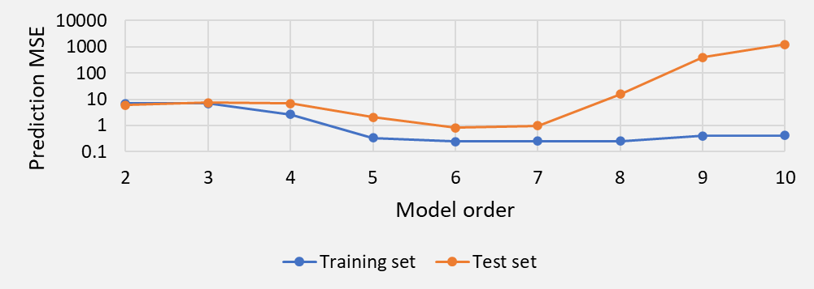
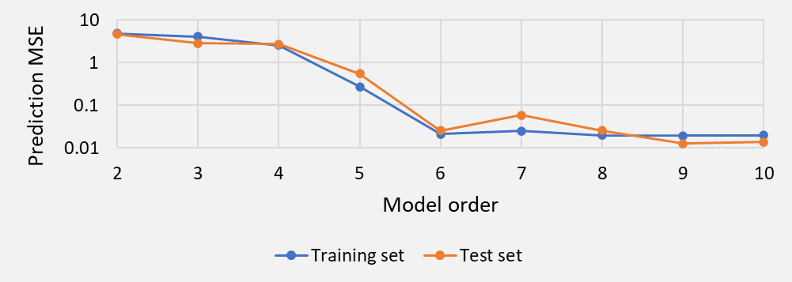
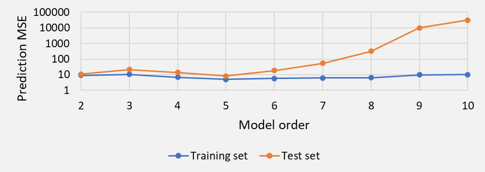
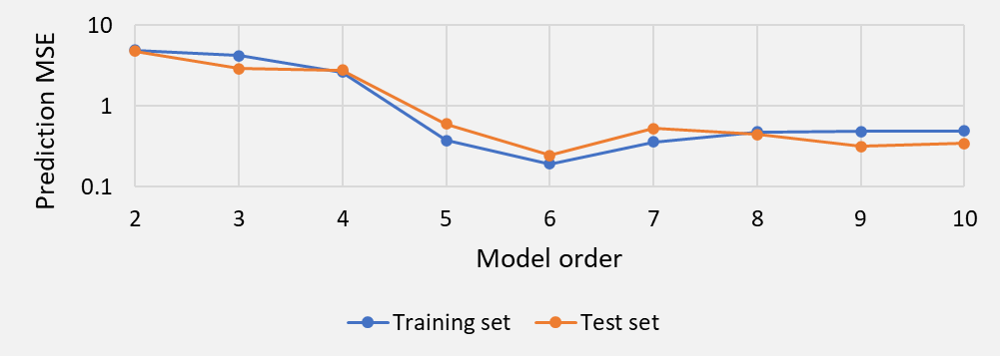

# Bias-Variance Tradeoff #
Hands-on experimentation.

## Table of Contents ##
1. [Motivation](#motivation)
2. [Example](#example)
3. [File Descriptions](#file_descriptions)
4. [Instructions for Use](#instructions_for_use)
5. [Author](#author)

## Motivation ##
This repository contains a simple Excel-based tool to give the budding data scientist a feel for **bias-variance tradeoff** – an important topic in data science and machine learning – by experimenting with hyperparameters, functions, training set size and noise level, all **without using any math, python or R**.

Fitting a model, in the context of **supervised training**, when data contain noise is a central competence for data scientists. The data scientist preselects a model’s **hyperparameters** (e.g., the order of a polynomial; the number of clusters in k-means clustering; the number of hidden layers in a neural network) and an algorithm calculates the model’s **parameters** (e.g., the coefficients in a polynomial; cluster centers in k-means clustering; the weights in a neural network).

Bias-variance tradeoff has to do with selecting hyperparameters so that the resulting model captures as much of the essential relationship among the data as possible without being distracted by noise. This is accomplished by splitting the data into two disjoint subsets. The first subset – called the “**training set**” – is used to fit the model using a preselected hyperparameter set and adjusting the parameters to (typically) minimize a mean-squared-error criterion. This model is run to predict the outputs of the second subset – the “**test set**” – and the goodness-of-fit is determined by comparison wih the known outputs. This procedure is repeated using different hyperparameter sets; the hyperparameter set that produces the best prediction for the test set is adopted.

This tool allows you to:
1. Try out a univariate "unknown" function of your choice;
2. Determine the impact of training set size;
3. Experiment with the test set size;
4. Try out different noise levels;
5. Switch between different realizations of the training and test sets.

## Example ##
The pre-configured example uses \$y=e^{-x} sin(2x)\$ defined over \x \epsilon [-3, 2]\$ as the "unknown" function. The model being fit is a polynomial of order (**hyperparameter**) between 2 and 10. The **parameter**s are the coefficients of the polynomial. The goal is to select the appropriate model order.

When the number of adjustable parameters (between 2 and 10)  is comparable to the number of observations (20), there is an optimal model order (6 in this example) as evidenced by the dip in the test MSE (orange line) in Figure 1. When the model order is low, the training and test MSEs are large (high bias). When the model order is high, the test MSE is large (high variance).

When the number of observations (200) is much larger than the number of adjustable parameters (between 2 and 10), the model is less prone to overfitting – the training and test MSEs as similar in all cases examined here (Figure 2; note the different y-axis scale compared to Figure 1). The bias for low model order is comparable to Figure 1 where the training set size is small, but the variance for high model order is now significantly smaller.

When the noise level increases (standard deviation of noise is 5x), the model trained using a small number of observations is even more susceptible to high variance (overfitting). Note the large test MSE at the right-hand side of Figure 3. A model trained using a large number of observations is less susceptible to overfitting – the training and test MSEs are comparable in Figure 4 for all model orders.

To look at it differently, we ask the question, “What if the model is trained using a different realization of the training set?” This is answered using Figures 5 and 6 below.
Consider how different each of the colored lines is from the others in Figure 5 and again in Figure 6. The colored lines in Figure 6 are grouped tightly (**low variance**) compared to Figure 5 (**high variance**), illustrating point #2 above – increasing the training set size reduces variance.

What about bias? In each figure, imagine the average of the colored lines. How closely does this average compare to the “actual” function (bold black line)? This is the bias. The bias is not shown in the figures below; you are encouraged to run the Excel tool and find out for yourself.

Looking at Figures 5 and 6, you may be wondering about fitting several models and averaging them into an “aggregate” model. That will be the subject of a future “Hands On” article.

## File Descriptions ##
There is only one Excel spreadsheet.
+ **Bias-Variance Tradeoff.xlsx**.

## Instructions for Use ##
1. Download the file in the [File Descriptions](#file_descriptions) section;
2. Open the Excel spreadsheet;
3. Set Excel's Calculation Options (Formulas >> Calculation >> Calculation Options) to Automatic. Do NOT set this option to Automatic Except for Data Tables or Manual;
4. Read the README tab;
5. Specify x_min and x_delta in the USER INPUT tab;
6. Specify a function of your choice in the USER INPUT tab;
7. In the RESULTS 1, RESULTS 2 and RESULTS 3 tabs, experiment with one or more of the following and view the charts:
  a. Model polynomial order (1 to 10);
  b. Training set size (20 to 800);
  c. Test set size (10 to 200);
  d. Noise standard deviation (1 to 5);
  e. Model name (this is the choice of one of five buil-in training sets).
  
## Author ##
Ashutosh A. Patwardhan ([GitHub](https://github.com/a1pat), [LinkedIn](https://www.linkedin.com/in/ashutosh-patwardhan/))